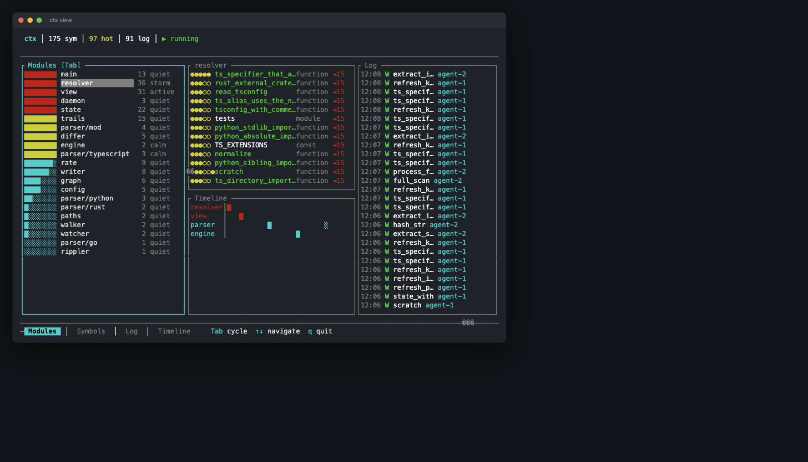

# ctx

**Codebase context tracker — like git for meaning.**

[](https://www.rust-lang.org)
[](#tests)
[](LICENSE)
[](#status)



`ctx` watches your codebase and tracks *where the work is happening* — which
symbols are being edited, how that activity ripples through the import graph,
and which code is "hot" right now. Git tracks what your code *is*; `ctx` tracks
what your code *means* and where attention is flowing.

It's built to feed compact, relevant context to AI coding agents: a tiny
`ctx brief <file>` injection tells an agent what's been touched recently, what
depends on it, and which symbols are active — without dumping the whole repo.

## How it works

```
   file change          parse + diff           ripple              decay
  ┌───────────┐       ┌──────────────┐      ┌──────────┐       ┌──────────┐
  │ you edit a │ ───► │ extract       │ ───► │ heat      │ ───► │ unused    │
  │ source file│       │ symbols,      │      │ propagates│       │ symbols   │
  │            │       │ detect added/ │      │ to        │       │ cool off  │
  │            │       │ modified/     │      │ dependent │       │ over time │
  │            │       │ removed       │      │ files     │       │           │
  └───────────┘       └──────────────┘      └──────────┘       └──────────┘
        │                                                              │
        └──────────────── persisted to .ctx/.state ───────────────────┘
```

1. **Watch** — a background daemon watches files with extensions you care about
   (`ts`, `tsx`, `js`, `jsx`, `rs`, `py`, `go` by default), ignoring
   `node_modules`, `target`, etc.
2. **Parse & diff** — on each change, `ctx` re-parses the file, extracts symbols
   (functions, classes, structs…) and imports, and diffs against the cached
   version to classify each symbol as **added / modified / removed**.
3. **Heat** — touched symbols gain **trail strength** (direct heat). Edits boost
   heat with a logarithmic curve so frequently-touched code climbs toward a cap
   rather than spiking.
4. **Ripple** — heat propagates outward through the import graph to dependent
   files as **ripple strength**, up to `max_ripple_depth` hops. A symbol's
   `total_heat = trail_strength + ripple_strength`.
5. **Decay** — on an interval, all heat is multiplied by a `decay_factor` so
   stale code cools off and the "hot set" reflects *current* work.

State lives in `.ctx/` (gitignore it): `config.toml`, `nest.md` (your coding
principles), `.state` (the tracked graph), and `project.ctx` (a generated
summary).

## Install

```bash
cargo build --release
# binary at target/release/ctx — put it on your PATH
cp target/release/ctx /usr/local/bin/
```

## Usage

```bash
ctx init            # scan the project, create .ctx/, parse all symbols
ctx start           # launch the background watcher daemon
ctx status          # daemon state + symbol/log counts + hot count
ctx view            # interactive TUI of the live heat map
ctx log [-l 20]     # recent change log with trail-strength dots
ctx stop            # stop the daemon
```

### For AI agents

```bash
# Compact, budget-limited context for a file (designed for hook injection)
ctx brief src/engine.rs --budget 500

# Dependency graph: what a file imports and what imports it (+ heat, activity)
ctx deps src/state.rs --depth 2 --json

# Register a worker trail: what files were touched and by whom
ctx touch src/foo.rs src/bar.rs --worker agent-1
```

`ctx brief` only emits output when there's recent activity, nearby active
dependencies, or tracked symbols — so it stays quiet and cheap when injected on
every file open. `ctx deps --json` gives agents a machine-readable view of
imports, dependents, per-file heat, and recent activity.

## Configuration

`.ctx/config.toml` (created by `ctx init`):

| Key | Default | Meaning |
|-----|---------|---------|
| `watch_extensions` | `ts,tsx,js,jsx,rs,py,go` | File types to track |
| `ignore_dirs` | `node_modules,.git,target,…` | Directories to skip |
| `decay_factor` | `0.9` | Heat multiplier per decay interval |
| `decay_interval_secs` | `600` | How often heat decays |
| `debounce_ms` | `300` | Coalesce rapid file-save bursts |
| `max_ripple_depth` | `3` | How far heat propagates through imports |
| `compaction_threshold` | `0.01` | Below this heat, symbols are dropped |

`.ctx/nest.md` holds the design principles `ctx` surfaces alongside context —
edit it to match your team's conventions.

## Project layout

```
src/
  main.rs        CLI entry + command handlers (init/start/stop/status/view/log/deps/brief/touch)
  daemon.rs      background watcher process management
  watcher.rs     filesystem event watching (notify)
  engine.rs      full scan + per-file change processing
  differ.rs      symbol-level diffing (added/modified/removed)
  parser/        per-language symbol & import extraction (typescript, rust, python, go)
  resolver.rs    import path → file resolution
  walker.rs      project file collection
  graph.rs       import graph + transitive dependents
  rippler.rs     heat propagation through the graph
  rate.rs        write-rate tracking (activity over time windows)
  state.rs       tracked symbols, heat model, persistence
  config.rs      .ctx/config.toml loading
  paths.rs       path → architectural-path / module helpers
  view.rs        interactive TUI (ratatui)
  writer.rs      generates .ctx/project.ctx summary
```

## Tests

```bash
cargo test          # 25 tests
```

Coverage is uneven and worth knowing before you trust it: the import resolver is
well covered (tsconfig `paths` walking, nearest-config resolution, comments and
trailing commas in `tsconfig.json`), and `view` covers state refresh including
torn reads. The heat model itself — `engine`, `differ`, `rippler`, `state` — is
exercised end-to-end by hand but has no unit tests yet.

## Status

v0.1 — early, and used daily on this repo, but not published to crates.io.

| Language | Symbols | Imports resolved |
|---|---|---|
| TypeScript / JS | ✅ | ✅ including `tsconfig` `paths` aliases |
| Rust | ✅ | ✅ `use crate::…` and `mod` |
| Python | ✅ | ✅ absolute and relative (`from .x import y`) |
| Go | ✅ | ❌ needs `go.mod` to map an import path to a directory |

Unresolvable specifiers (stdlib, third-party packages) are dropped rather than
filtered by a maintained ignore list — they have no file in the project, so
there is nothing for heat to ripple to.

## License

MIT — see [LICENSE](LICENSE).
